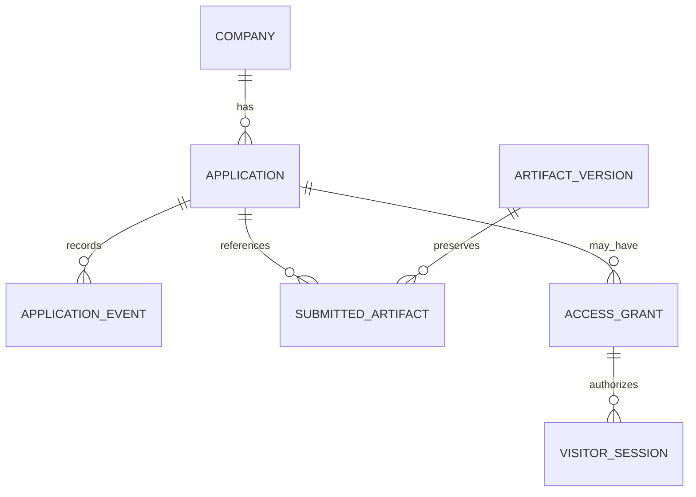

# Diagram Catalog

## Application and artifact relationships

```mermaid
erDiagram
  COMPANY ||--o{ APPLICATION : has
  APPLICATION ||--o{ APPLICATION_EVENT : records
  APPLICATION ||--o{ SUBMITTED_ARTIFACT : references
  ARTIFACT_VERSION ||--o{ SUBMITTED_ARTIFACT : preserves
  APPLICATION ||--o{ ACCESS_GRANT : may_have
  ACCESS_GRANT ||--o{ VISITOR_SESSION : authorizes
```

The diagram is conceptual. Direct-request grants also exist outside the application association.
